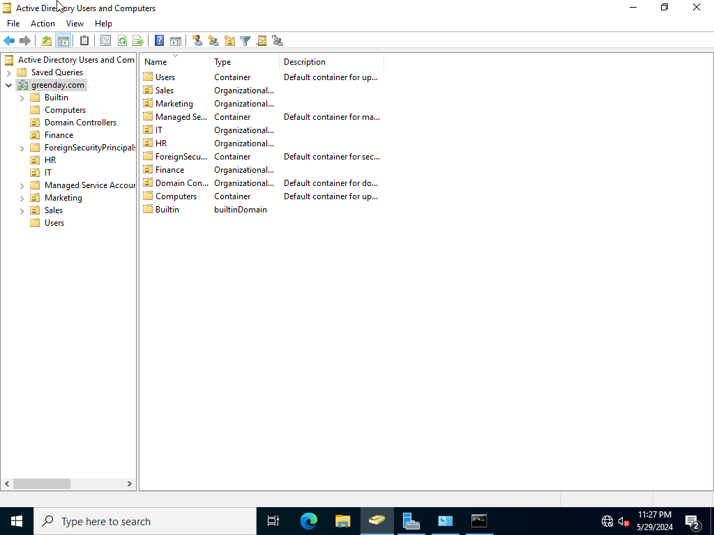

# Active Directory Installation Guide
• This project provides a comprehensive guide to installing and configuring Active Directory using VirtualBox. 
• It includes steps for setting up a Windows Server 2022 as a domain controller and connecting a client PC to the domain.

## Table of Contents

1. [Prerequisites](#prerequisites)
2. [Setting Up VirtualBox](#setting-up-virtualbox)
    - [Installing VirtualBox](#installing-virtualbox)
3. [Creating Virtual Machines](#creating-virtual-machines)
    - [Create a Domain Controller (Windows Server 2022) VM](#create-a-domain-controller-windows-server-2022-vm)
    - [Create a Client PC (Windows 10) VM](#create-a-client-pc-windows-10-vm)
4. [Installing Windows Server and Active Directory](#installing-windows-server-and-active-directory)
    - [Installing Windows Server](#installing-windows-server)
    - [Configuring the Server for Active Directory](#configuring-the-server-for-active-directory)
5. [Configuring Active Directory](#configuring-active-directory)
    - [Promoting the Server to a Domain Controller](#promoting-the-server-to-a-domain-controller)
    - [Creating User Accounts and Organizational Units](#creating-user-accounts-and-organizational-units)
6. [Setting Up Client PC](#setting-up-client-pc)
    - [Installing Windows](#installing-windows)
    - [Connecting the Client PC to the Domain](#connecting-the-client-pc-to-the-domain)
7. [Testing and Verification](#testing-and-verification)
    - [Testing the Connection](#testing-the-connection)
    - [Logging in with a Domain Account](#logging-in-with-a-domain-account)
    - [Checking Server Manager](#checking-server-manager)
8. [Troubleshooting](#troubleshooting)
    - [Common Issues and Solutions](#common-issues-and-solutions)
        - [Issue: Unable to Join Domain](#issue-unable-to-join-domain)
        - [Issue: DNS Issues](#issue-dns-issues)
        - [Issue: Time Synchronization Problems](#issue-time-synchronization-problems)
        - [Issue: Incorrect Domain Name](#issue-incorrect-domain-name)
        - [Issue: Account Permissions](#issue-account-permissions)
        - [Issue: Active Directory Services Not Running](#issue-active-directory-services-not-running)
        - [Issue: Computer Account Already Exists](#issue-computer-account-already-exists)
        - [Issue: Group Policy Issues](#issue-group-policy-issues)
        - [Issue: Network Location Awareness](#issue-network-location-awareness)
        - [Issue: IPV6 Configuration](#issue-ipv6-configuration)
        - [Issue: Duplicate SPN](#issue-duplicate-spn)
    - [Additional Tools for Troubleshooting](#additional-tools-for-troubleshooting)

# Prerequisites

- [VirtualBox](https://www.virtualbox.org/) installed on your computer.
- ISO files for [Windows Server 2022](https://www.microsoft.com/en-us/evalcenter/evaluate-windows-server-2022) and Windows client (e.g., [Windows 10](https://www.microsoft.com/en-ca/software-download/windows10)).
- Basic understanding of networking concepts.

## 1. Setting Up VirtualBox

### Installing VirtualBox

Download and install VirtualBox from [here](https://www.virtualbox.org/).


## 2. Creating Virtual Machines

### Create a Domain Controller (Windows Server 2022) VM


1. Open VirtualBox and click on `New`.
2. Name the VM (e.g., `DC-01`) and select `Microsoft Windows` and `Windows 2022 (64-bit)`.
3. Allocate at least 2GB of RAM.
4. Create a virtual hard disk (VDI) with at least 20GB of storage.
5. Attach the Windows Server ISO to the VM's optical drive.
6. Run the installer. 
7. Choose the language and region and click `Install Now`.
8. In the the menu, select `Windows Server 2022 Standart Evaluation (Desktop Experience)`.


9. Choose a VDI that you created and proceed with installation.

### Create a Client PC (Windows 10) VM

1. Follow similar steps to create another VM (e.g., `Client-PC`).
2. Allocate at least 2GB of RAM.
3. Attach the Windows 10 ISO to the VM's optical drive.


## 3. Installing Windows Server and Active Directory

### Installing Windows Server

1. Start the `DC-01` VM and boot from the ISO.
2. Follow the installation prompts to install Windows Server.
3. Set a strong administrator password.

### Configuring the Server for Active Directory

1. Open File Explorer, right click `This PC` and press `Properties`.
2. In the first window, change the device name to `Server2022`.
3. Reboot the VM.
4. Open Server Manager.
5. Click on `Add roles and features`.
6. Select `Active Directory Domain Services` and follow the prompts to install.

## 4. Configuring Active Directory

### Promoting the Server to a Domain Controller

1. In Server Manager, click on the flag notification and select `Promote this server to a domain controller`.
2. Add a new forest and name your domain (lets use `greenday.com` as a domain name).
3. Follow the prompts, setting the Directory Services Restore Mode (DSRM) password.
4. Restart the server once the configuration is complete.


### Creating User Accounts and Organizational Units

1. Open `Active Directory Users and Computers`.
2. Create Organizational Units (OUs) for different departments.
3. Right-click on the OU and select `New > User` to create user accounts.



There are better and more efficient ways to add objects in Active Directory. However, as this is a tutorial we can create a new user 'helpdesk' just as an example.


## 5. Setting Up Client PC

### Installing Windows

1. Start the `Client-PC` VM and boot from the ISO.
2. Follow the installation prompts to install Windows 10.
3. When choosing a version of Windows 10, choose `Windows 10 Pro`.


4. Set up a local account.

### Connecting the Client PC to the Domain

1. Log in to the client PC with the local account.
2. Open File Explorer, right click `This PC` and press `Properties`.
3. In the first window, change the device name to `HOST-PC1`.
4. Reboot the VM.
5. After rebooting, go to `Settings > System > About` and click on `Join a domain`.


6. Enter the domain name (in our example, we will use a domain name `greenday.com`).
7. Provide the domain credentials (a user account or in our case we will use admin credentials).
8. Restart the client PC.

## 6. Testing and Verification

### Testing the Connection

1. Log in to the client PC with a domain account.
2. Open `Command Prompt` and run `ping DC-01` to ensure connectivity.

### Logging in with a Domain Account

1. On the client PC, select `Other user` on the login screen.


2. Enter the domain credentials and log in.

### Checking Server Manager

• As you can see, our `HOST-PC1` has been successully added to the domain.


# Troubleshooting

## Common Issues and Solutions

### Issue: Unable to Join Domain

- **Solution:** Ensure the client PC can reach the domain controller. Check the following:
  - **Network Connectivity**: Verify that the client PC and the domain controller are on the same network or have proper routing between networks.
  - **Firewall Settings**: Ensure that the firewall on the domain controller is not blocking necessary ports (e.g., TCP/UDP 389 for LDAP, TCP 88 for Kerberos, TCP 445 for SMB).
  - **Ping Test**: From the client PC, ping the domain controller by its IP address and hostname to confirm connectivity.

### Issue: DNS Issues

- **Solution:** Ensure the domain controller's IP address is set as the primary DNS server on the client PC. Additionally:
  - **DNS Configuration**: Verify that the DNS server is configured correctly and that the domain controller's A and SRV records are present in the DNS zone.
  - **Flush DNS Cache**: Run `ipconfig /flushdns` on the client PC to clear any cached DNS entries that might be outdated.

### Issue: Time Synchronization Problems

- **Solution:** Ensure that the client PC's time is synchronized with the domain controller. Kerberos authentication is time-sensitive and requires the time difference to be within 5 minutes. Run the following on the client PC:
  ```powershell
  w32tm /resync

### Issue: Incorrect Domain Name
- **Solution:** Double-check the domain name being entered on the client PC. Ensure it matches the domain name configured on the domain controller. Use the fully qualified domain name (FQDN) when joining the domain.

### Issue: Account Permissions
- **Solution:** Ensure the account being used to join the domain has sufficient permissions. The account should be a member of the Domain Admins group or have delegated permissions to join computers to the domain.

### Issue: Active Directory Services Not Running
- **Solution:** Verify that all necessary Active Directory services are running on the domain controller. Check the status of the following services and start them if they are stopped:
  - **Active Directory Domain Services**
  - **DNS Server**
  - **Kerberos Key Distribution Center**

### Issue: Computer Account Already Exists
- **Solution:** If the computer account already exists in Active Directory, it might need to be reset. On the domain controller, open `Active Directory Users and Computers`, find the computer account, right-click, and select `Reset Account`.

### Issue: Group Policy Issues
- **Solution:** Ensure that Group Policy Objects (GPOs) are applied correctly:
  - **Run gpupdate**: On the client PC, run `gpupdate /force` to force a Group Policy update.
  - **Check GPO Status**: Use the `gpresult /r` command on the client PC to check the applied GPOs and identify any issues.

### Issue: Network Location Awareness
- **Solution:** Ensure that the network location is set correctly on the client PC:
  - **Private Network**: The network connection should be set to Private (not Public) to allow proper domain discovery and communication.

### Issue: IPV6 Configuration
- **Solution:** If IPV6 is enabled but not configured properly, it can cause issues:
  - **Disable IPV6**: Temporarily disable IPV6 on both the client PC and the domain controller to see if it resolves the issue. This can be done through the network adapter settings.

### Issue: Duplicate SPN
- **Solution:** Service Principal Names (SPNs) must be unique in the domain. Duplicate SPNs can cause authentication issues:
  - **Check for Duplicates**: Use the `setspn -X` command on the domain controller to check for duplicate SPNs and resolve any found.

## Additional Tools for Troubleshooting
- **Dcdiag**: Run the `dcdiag` command on the domain controller to perform a comprehensive health check of the Active Directory domain.
- **Event Viewer**: Check the Event Viewer logs on both the domain controller and client PC for any errors related to Active Directory, DNS, or networking.
- **Netdom**: Use the `netdom` command-line tool for domain management tasks, such as resetting a machine account password: 

  ```powershell
  netdom resetpwd /s:server /ud:domain\User /pd:password
